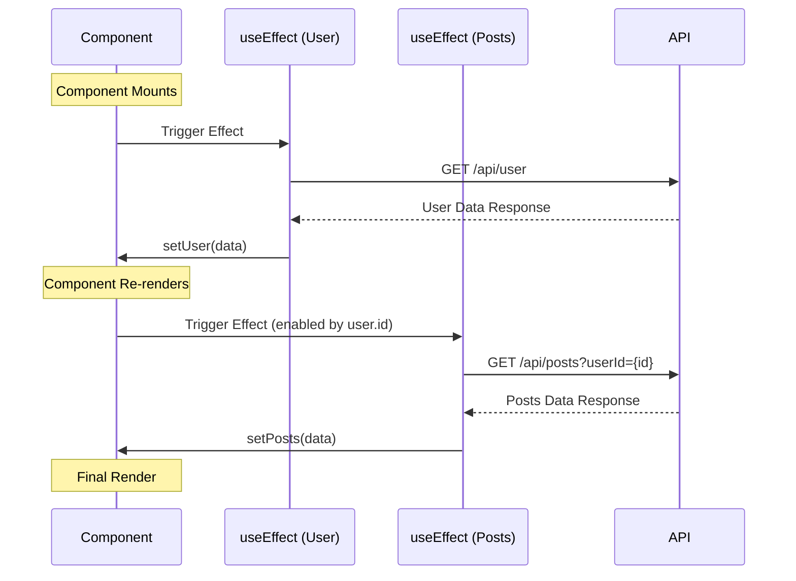
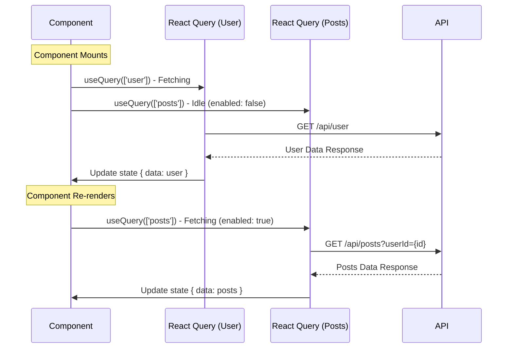
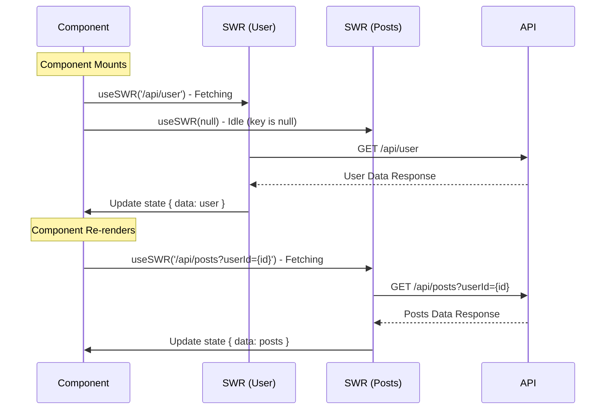

# Request Lifecycle Flow Diagrams

This document illustrates the request lifecycle for dependent queries (User → Posts) across three different implementations: `useEffect`, React Query, and SWR.

## 1. Manual Implementation (useEffect)

The manual implementation relies on state changes to trigger sequential effects.

## 2. React Query Implementation

React Query uses the `enabled` flag to manage dependencies declaratively.

## 3. SWR Implementation

SWR uses conditional fetching (returning `null` for the key) to handle dependencies.

## Key Observations

- **useEffect**: Requires manual orchestration of state and cleanup. Errors in dependency arrays can lead to infinite loops or missed updates.
- **React Query**: Provides a robust `enabled` flag. Caching is handled automatically, and the lifecycle is transparent through DevTools.
- **SWR**: Uses a simple but effective "null key" pattern for dependencies. Lightweight and focuses on revalidation.
